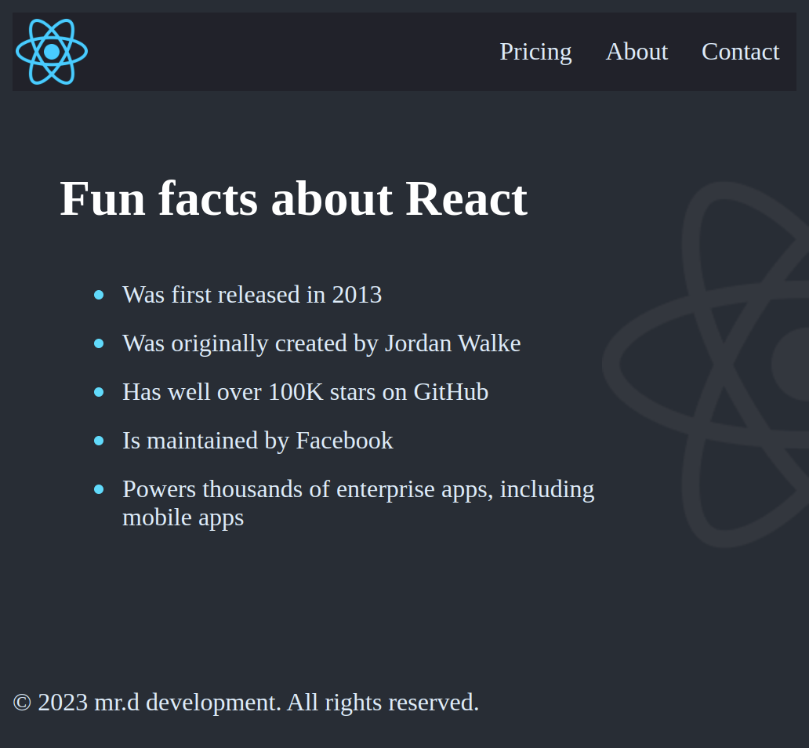

# React fun fact project

This project built for learning react basic.

### What I learned
- I learn about What is react?
- Why is usefull?
- Why we should learning react?
- What is JSX?
- How JSX works?
- What does React-dom doing?
- What is "composable" programming?
- What does it mean for something to be "declarative" instead of "imperative"?

### Screenshot

## My process

### Built with

- Semantic HTML5 markup
- CSS custom properties
- JavaScript
- Flexbox
- [React](https://reactjs.org/) - JS library

### Continued development

In next project i will learning about props ( "What is props, the concept of props and props syntax" ),creating component from an array

## Author

- github.com/mr-dargi
